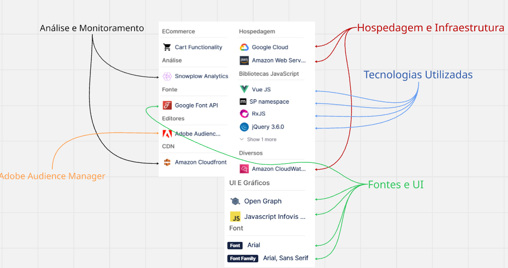

## 🛒 Análise do Site: **amazon.com.br**

### 🌐 Tipo de Site

E-commerce de grande escala, voltado para vendas online, logística, streaming e serviços digitais.

---

### 🧱 Tecnologias Utilizadas

#### 🔹 **Front-end**

* **HTML5** – Estrutura das páginas
* **CSS3** – Estilização e layout
* **JavaScript** – Interatividade e comportamento dinâmico
* **Vue.js** – Framework JavaScript para construção de interfaces reativas
* **RxJS** – Programação reativa para lidar com eventos e dados assíncronos
* **jQuery 3.6.0** – Manipulação do DOM e compatibilidade com scripts legados

---

#### ☁️ **Hospedagem e Infraestrutura**

* **Amazon Web Services (AWS)** – Infraestrutura principal de nuvem
* **Google Cloud** – Serviços complementares de cloud computing
* **Amazon CloudFront (CDN)** – Distribuição de conteúdo com alta performance e baixa latência

---

#### 📊 **Análise e Monitoramento**

* **Snowplow Analytics** – Coleta e análise de dados de comportamento do usuário
* **Amazon CloudWatch** – Monitoramento de aplicações, servidores e desempenho

---

#### 🎯 **Marketing e Personalização**

* **Adobe Audience Manager** – Gerenciamento de audiência e dados para marketing direcionado

---

#### 🔤 **Fontes e UI**

* **Google Font API** – Carregamento de fontes externas
* **Arial / Sans Serif** – Tipografia padrão
* **Open Graph** – Otimização de compartilhamento em redes sociais
* **JavaScript Infovis Toolkit** – Visualização de dados

---

### 🧠 **Conclusão**

O site **amazon.com.br** utiliza uma arquitetura moderna, escalável e altamente performática, combinando frameworks JavaScript, serviços em nuvem e ferramentas avançadas de monitoramento. O uso da AWS aliado a CDNs e bibliotecas reativas garante alta disponibilidade, rapidez e uma experiência de usuário eficiente, mesmo com grande volume de acessos simultâneos.
