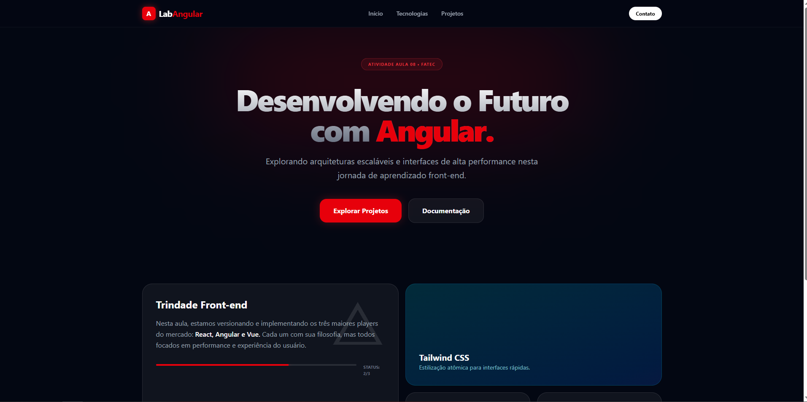
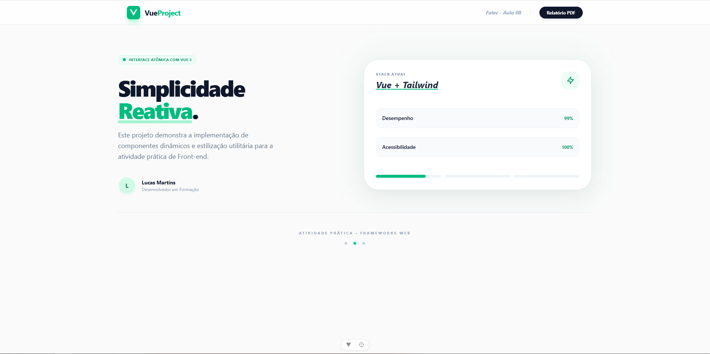
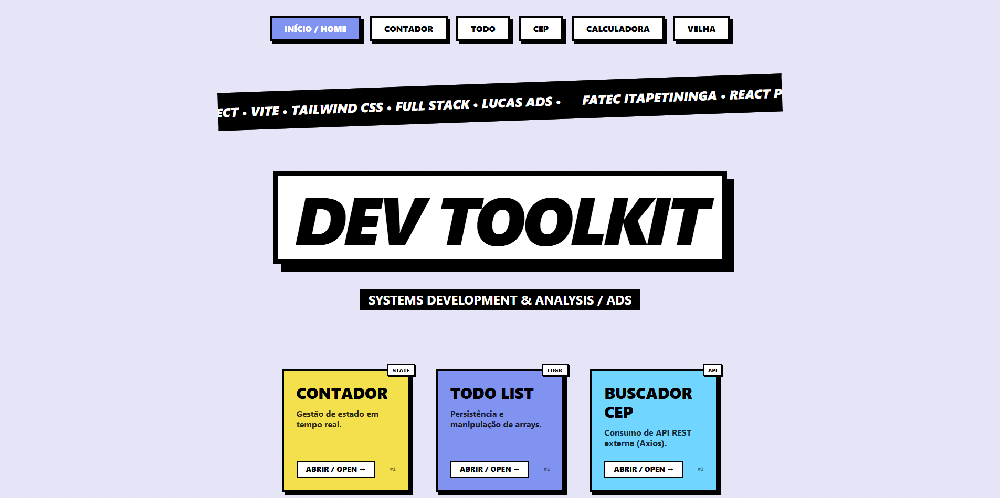

# 🚀 Trinity Front-end: Angular, Vue & React

Este projeto apresenta a implementação de três interfaces modernas utilizando os frameworks mais populares do mercado. Cada aplicação foi estilizada com **Tailwind CSS**, focando em tendências de design de 2025 como *Glassmorphism*, *Bento Grids* e *Dark Mode*.

---

## 📸 Demonstração das Interfaces

### 1. Angular (Dark Mode & Bento Grid)
Uma interface robusta com foco em cartões informativos e profundidade visual.

### 2. Vue.js (Clean Tech & Glassmorphism)
Design minimalista com efeitos de transparência e foco em alta legibilidade.

### 3. React (Ocean Blue & Modern UI)
Estética focada em contraste e tipografia para aplicações tipo SaaS.

---

## 🛠️ Passo a Passo de Instalação e Execução

### 🅰️ Projeto Angular
1. Entre na pasta: `cd angular/projetoangular`
2. Instale as dependências: `npm install`
3. Execute: `npx ng serve` ou `npm start`
*Aceda em: http://localhost:4200*

### 🟢 Projeto Vue.js
1. Entre na pasta: `cd vue/vue-project`
2. Instale as dependências: `npm install`
3. Execute: `npm run dev`
*Aceda em: http://localhost:5173*

### ⚛️ Projeto React
1. Entre na pasta: `cd react/projeto-pratico`
2. Instale as dependências: `npm install`
3. Execute: `npm start`
*Aceda em: http://localhost:3000*

---

## 🧪 Tecnologias e Desafios
* **Tailwind CSS v4:** Utilizado para garantir que o estilo fosse consistente e rápido de implementar em todas as stacks.
* **TypeScript:** Aplicado no Vue e Angular para garantir maior segurança no código.
* **Componentização:** Cada projeto foi estruturado para ser modular e fácil de manter.

---

## 🎓 Informações do Aluno
* **Instituição:** Fatec - Disciplina de Programação Web
* **Atividade:** Aula 08 - Comparativo de Frameworks
* **Desenvolvedor:** [Lucas Martins]